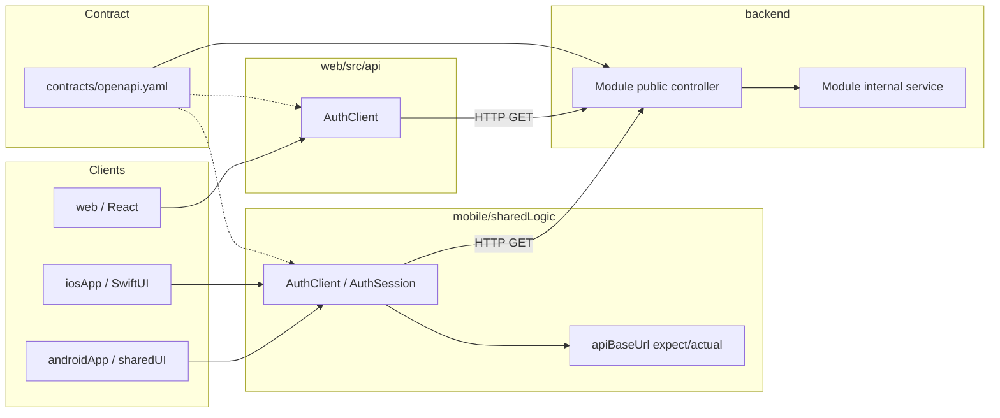

# Architecture

Long-lived design decisions for **family-carpool**. Feature-specific detail lives
in `docs/specs/`; this document explains *how the repo is organized* and *how
work flows through it*.

## What this repo is

**family-carpool** is a product repo created from the quickapp SDD starter (see
`docs/using-as-template.md` for upstream template notes). Workflow:
roadmap → spec → contract → backend module → mobile/web clients → UI.

The disposable **greeting** harness was removed with the first product feature
(`adult-auth-magic-link`). Cross-stack smoke is **email OTP auth** plus
**family circle + kids + named places**.

Proven toolchain checkpoints (from the starter) remain valid; the live product
path is auth → family:

| Checkpoint | Proves |
|------------|--------|
| 1 | Gradle + Spring Modulith backend (Java 25, `ModularityTests`) |
| 2 | KMP `sharedLogic` callable from native Android and iOS |
| 3 | Full cross-stack path: OpenAPI → REST endpoint → Ktor client → native UI |

Web (`web/`) is a fourth consumer of the same OpenAPI contract (React +
path-filtered CI).

## Auth (v1)

Locked for `adult-auth-magic-link` (see archive spec):

| Topic | Decision |
|--------|----------|
| Proof | Email one-time code only (no magic link in v1) |
| Session | Opaque **Bearer** token on web + Android + iOS |
| First verify | Auto-create adult; `displayName` set when creating a family circle |
| Persistence | Postgres + Flyway; Testcontainers in backend integration tests |
| Dev mail | `LoggingAuthMailPort` + optional `app.auth.dev-code-echo` |
| Prod mail | Upcoming `auth-email-delivery` (pre-beta) |
| Web hardening | Upcoming `web-auth-session-hardening` (HTTP-only cookie; pre-beta) |
| Mobile tokens | Android `EncryptedSharedPreferences`; iOS Keychain |
| Unreachable ≠ expired | Clients tell "backend not reachable" (`AuthApiException.unreachable` on mobile) apart from "server rejected the token". Only a rejection clears the stored token, and it clears **locally** (`AuthSession.clearLocalSession()`) — never via a second network call, which is what crashed Android restore. A blip keeps the session so a retry works. A failed circle load shows **Retry**, never Create family (a failure says nothing about whether a circle exists). **Sign out** always drops the local session even when the server call fails. Web + Android follow this; **iOS** still bounces to the sign-in screen on an unreachable `/api/auth/me` (token kept, no crash) — parity is a follow-up |

Modulith module: `backend/modules/auth/`. Contract paths under `/api/auth/*`.
Public surface for other modules: `AdultSessionApi` (resolve Bearer adult,
look up adult by id, update `displayName`).

## Family circle (v1)

Locked for `family-circle-and-kids` + `family-adult-invites-roles` +
`named-places` + `place-geocoding` + `activity-feed-subscribe` +
`activity-feed-poller` + `manual-events` + `family-calendar-surface` +
`app-shell-navigation` (client shell IA) + `event-leave-by-estimate` +
`coverage-confirm-decline`:

| Topic | Decision |
|--------|----------|
| Cardinality | **At most one** circle membership per adult (multi-circle → parking) |
| Create | Required adult display name; optional circle name (UI: “Your family”) |
| Role on create | `ORGANIZER` |
| Invite | One active **short code** per circle; Organizer views/regenerates (no TTL); share out of band |
| Join | Signed-in adult with no membership accepts code → **CAREGIVER**; already a member → **409** |
| Promote / demote | Organizer may change roles; circle always keeps **≥1 Organizer** |
| Leave | Caregiver anytime; Organizer only if another Organizer remains; sole Organizer only if alone + **zero kids** |
| Writes | **Organizer-only:** invite regen, members/roles, rename circle, kids CRUD, **activity feed** CRUD + Sync now. **Any member:** named places (+ retry locate), **manual events**, **calendar agenda read**, **own leave-from** per calendar item, **own default leave-from**, **coverage** assign/reassign/remove (any member) + confirm/decline (assignee only). All members may read circle (Caregivers omit feed manage UI) |
| Kid | Stable id + display name only (no birth year / player vs sibling type) |
| Place | Circle-scoped label + free-text address; **unique name per circle** (trim + case-insensitive); optional WGS84 `latitude`/`longitude` |
| Geocoding | **Nominatim** (OSM) via `GeocoderPort`; address→coords **cache**; ~1 req/s + identifying User-Agent; create/update **soft-fail** (place saved, coords null on miss/error); `POST .../places/{id}/locate` retries; clients show Located / Not located + Retry locate. Same cache path geocodes event free-text `location` for leave-by destinations (public `FamilyGeocodeApi`). **Prod deploy:** set `GEOCODE_USER_AGENT` to a real contact (email or public app URL) — placeholder/`example.com` contacts get **403** from public Nominatim |
| Activity feeds | Circle-scoped iCal/webcal subscription (`name`, normalized `sourceUrl`, 0+ `kidIds`); **auto-sync** on create and URL change + explicit **Sync now**; soft-fail writes `lastSyncError` (prior event snapshot kept); successful sync **upserts by iCal `UID`** (stable event UUIDs for Agenda / coverage / leave-from) and deletes only removed UIDs; null-UID rows matched by summary/starts/ends/location fingerprint when possible; duplicate normalized URL → **409**; invalid kid id → **400**; `webcal://` → `https://` for fetch. **Background poll** (`FeedsPoller`): default **30 minutes** (`FEEDS_POLL_INTERVAL_MS`); toggle with `FEEDS_POLL_ENABLED` (off in CI/tests); sequential sync with short inter-feed delay; reuses the Sync now path; **single app instance assumed** for v1 (no multi-replica lease). Clients: Organizer **Refresh** re-GETs the feeds list only (does not sync-all); Sync now stays per-feed. CI uses stub fetch + fixture `.ics` files — no live vendor hosts. **Prod:** set `FEEDS_USER_AGENT` to a real contact (same spirit as geocoding) |
| Manual events | Circle-scoped one-offs (`title`, `startsAt`, optional `endsAt`/`location`, **1+ `kidIds`**); any member CRUD via `/events`; hard delete; list API remains; separate from feed snapshots (`events` module). Primary client UX is **Agenda** (not a dedicated manage-events list) |
| Calendar agenda | Unified `GET /api/family/circle/calendar?from&to` (`[from, to)`); any member; merges manual + feed items ordered by `startsAt`; feed rows carry feed kid links + `feedName`; each row enriched for the **current adult** with leave-from + leave-by (see Leave-by below) and **circle-visible coverage** (`coverages` + `uncoveredKidIds`); clients load **local today → +30d**, then **Load more** appends the next 30-day page (same API); optional kid filter; manual writes from agenda; Sync now / feed writes reload the loaded range; month grid → `family-calendar-grid` |
| Coverage | **Responsibility** for kid(s) on a calendar item — not seats, vehicles, or trips (those → carpool). Many rows per item; each row = covering adult + non-empty kid subset + `PENDING`\|`CONFIRMED`\|`DECLINED`. Any member may assign / reassign / remove; assignee confirms or declines; **self-assign → `CONFIRMED`**. Kid exclusive across **active** (`PENDING`\|`CONFIRMED`) rows on the same item; multi-kid per adult OK. Declined kids count as uncovered. Modulith: `backend/modules/coverage/`; HTTP under `/api/family/circle/calendar/...` (calendar controllers call `CoverageApi`). Conflict amber UI → [`conflict-detection`](roadmap.md) |
| Leave-by | Per **signed-in adult** + calendar item (`source` + `id`): optional leave-from place override. Origin resolution order: **per-item override → membership default leave-from → first located place by name**. Estimate: `leaveBy ≈ startsAt − (travelDuration × TOD multiplier + fixedBuffer)`. Travel from **OSRM** when origin + destination coords exist; missing coords → `leaveByStatus=UNAVAILABLE` (soft-fail, calendar GET still succeeds); both coords OK but OSRM down → config **fallback duration**, still labeled **estimate**. Destination = geocode of item `location` (no destination place FK). Recovery: origin via leave-from / Places locate / default leave-from; MANUAL destination via edit `location`; no lat/lng editors; no FEED destination override in this slice. Activity-type arrival lead times → [`event-arrival-lead-time`](specs/planned/event-arrival-lead-time.md). **OSRM is PoC-free routing**; upgrade path parked as [`paid-live-traffic`](roadmap.md) |
| Empty circle | Allowed (add kids / places / feeds / manual events later) |
| Signed-in shell | **Client IA only** (`app-shell-navigation`): four destinations in order **Calendar → Carpool → Family → More/Settings**. Calendar = Agenda; Carpool = reserved “Coming soon” placeholder (no flows yet); Family = circle/invite/members/kids/leave; More (mobile) / Settings (web) groups **General** (Places; Feeds for Organizers only — Caregiver row omitted) and **Account** (email/role, danger-styled Sign out). Chrome adapts: **bottom tabs** on iOS/Android, **sidebar** on web (not a tab-bar clone). Shell appears only in Ready (has circle); default landing **Calendar**. Auth and create/join stay outside the shell |

**Write authorization (two intentional categories):**

1. **Organizer plumbing** — who is in the circle and how external calendars are
   wired: kids, invite/roles, circle rename, **activity feeds** (+ Sync now /
   poller). Caregivers consume synced feed events via the **calendar Agenda**;
   they do not manage subscribe URLs.
2. **Any-member household content** — day-to-day shared facts everyone may
   contribute: **named places** (+ retry locate) and **manual events**. Same
   write policy for both; no creator-only edit rules in v1. **Leave-from**
   (per-item override + **default leave-from** on membership) is any-member
   but **per adult**. **Coverage** assign/reassign/remove is any-member
   shared intent; confirm/decline is assignee-only.

Modulith modules: `backend/modules/family/` (circle, kids, places, membership
API + public `FamilyPlaceApi` / `FamilyGeocodeApi`), `backend/modules/feeds/`
(subscriptions + synced events), `backend/modules/events/` (manual events),
`backend/modules/leaveby/` (OSRM port, leave-from persistence, estimate math),
`backend/modules/coverage/` (assignment rows + confirm/decline rules),
and `backend/modules/calendar/` (orchestrates feeds + events public APIs into
the unified agenda read and composes leave-by + coverage enrichment — no
imports of other modules’ `internal` packages). Contract paths under
`/api/family/*`. Family public surface used by feeds, events, calendar,
leaveby, and coverage: `FamilyMembershipApi` (`requireOrganizerCircleId` /
`requireMemberCircleId` / adult-in-circle checks, validate kids),
`FamilyPlaceApi` (includes `findDefaultLeaveFromForMember`),
`FamilyGeocodeApi`. Auth public surface used by family: `AdultSessionApi`
(`requireCurrentAdult`, `requireAdult`, `updateDisplayName`). Leaveby public
surface used by calendar: `LeaveByApi`. Coverage public surface used by
calendar: `CoverageApi`.

**How objects link (extensible):**

- **Adult** ↔ **circle** via membership (+ role `ORGANIZER` | `CAREGIVER`)
- **Invite code** lives on the circle (not per-member)
- **Kid** belongs to a **circle**
- **Place** belongs to a **circle** (shared origins for leave-by / coverage);
  coords come from geocoding the address, not manual entry
- **ActivityFeed** belongs to a **circle**; **feed↔kid** links mean “on this
  team / calendar.” Sibling vs player is not a kid kind — it falls out of whether
  a kid has feed links. Carpool spaces stay separate from feeds (parent invite).
  Synced **FeedEvent** rows are feed-scoped storage composed into the Agenda via
  `family-calendar-surface`; manage-feeds only exposes sync status + event count.
- **ManualEvent** belongs to a **circle** with **1+ kids**; not owned by a feed;
  not touched by Sync now / poller.
- **Leave-from override** is per **adult** + calendar item (`MANUAL`|`FEED` +
  item id) → a circle **Place**; not shared across adults. **Default
  leave-from** is per **membership** → a located circle **Place**. Leave-by
  estimates are computed at calendar read time for the signed-in adult only.
- **Coverage assignment** belongs to a calendar item (`MANUAL`|`FEED` + item
  id) with covering adult + kid subset + status; visible to all circle members
  on Agenda. Not a vehicle/trip plan — seats and nonplayers stay in carpool.

```
Adult --membership(+role, default leave-from?)--> FamilyCircle <-- Kid
                                  |
                             invite_code
                                  |
                               Place (+ optional lat/lng)
                                  |
                             ActivityFeed --feed↔kid--> Kid
                                  |
                            FeedEvent (UID snapshot)
                                  |
                             ManualEvent --event↔kid--> Kid
                                  |
Adult --leave-from override--> (source + itemId) --> Place
Adult --coverage assignment--> (source + itemId) + Kid(s)
```

### Leave-by estimate (detail)

Locked for `event-leave-by-estimate`:

| Topic | Decision |
|--------|----------|
| Formula | `leaveBy ≈ startsAt − (travelSeconds × TOD multiplier + fixedBufferSeconds)` |
| TOD | Peak vs off-peak multipliers; peak windows use `startsAt` hour in **UTC** (config under `app.leaveby.*`) |
| Travel | OSRM driving duration when origin place and destination geocode both have coords |
| Soft-fail | Blank location → `NO_DESTINATION`; geocode miss → `GEOCODE_FAILED`; no located origin → `NO_ORIGIN`; calendar list never fails for a single bad row |
| OSRM down | Config `fallback-duration-seconds`; status still `OK` and UI still says **estimate** |
| Default origin | **Override → membership default leave-from → first located place by name** (case-insensitive); else `UNAVAILABLE` |
| UI copy | Always **estimate** — never “live traffic” / “ETA” |
| Not in this slice | Activity-type arrival lead times → [`event-arrival-lead-time`](specs/planned/event-arrival-lead-time.md) |
| Routing upgrade | OSRM is free/self-hostable **PoC** routing. If leave-by proves value, replace or supplement with a paid live-traffic provider — parked as [`paid-live-traffic`](roadmap.md) |

### Coverage (detail)

Locked for `coverage-confirm-decline`:

| Topic | Decision |
|--------|----------|
| Meaning | Who is **responsible** for which kid(s) on an Agenda item |
| Status | `PENDING` (assigned to someone else), `CONFIRMED` (self-assign or assignee OK), `DECLINED` |
| Authz | Assign / reassign / remove: any member. Confirm / decline: covering adult only (**403** otherwise) |
| Kids | Non-empty subset of item kids; exclusive on active rows; multi-kid per adult OK |
| Leave-from | Not on the coverage row — reuse leave-by (default + per-item override) |
| Client UX | Web is the reference client — see [`agenda-coverage-web-contract.md`](agenda-coverage-web-contract.md) (stable). iOS/Android ports match that contract |
| Out of scope | Conflict amber UI → `conflict-detection`; seats / vehicles / nonplayers → carpool |

Config / CI: `LEAVEBY_OSRM_PROVIDER` (`http` \| `stub`), `LEAVEBY_OSRM_BASE_URL`, buffer / multipliers / fallback env vars under `app.leaveby`. Tests force stub OSRM + stub geocode (no live public hosts).

## Interaction UX

Locked for [`calendar-ux-flow`](specs/archive/calendar-ux-flow.md). Living reference
surface: **Calendar / Agenda** (web is the behavior reference —
[`agenda-coverage-web-contract.md`](agenda-coverage-web-contract.md); iOS/Android
match decisions and strings). Distinct custom UI — not a rideshare clone.
Inspiration only: [Laws of UX that Uber follows](https://medium.com/design-bootcamp/laws-of-ux-that-uber-follows-fa7c6619748b).

### Tenets

| Tenet | Meaning for this product |
|--------|---------------------------|
| Aesthetic-Usability | Clear hierarchy and spacing make Agenda feel usable, not sparse chrome |
| Doherty | Focused busy feedback (Save → Saving…, Load more → Loading…) feels instant; **Sign out** never becomes Working… |
| Fitts | Primary actions are large enough and easy to hit (especially mobile) |
| Hick | Few choices per step; sole-option defaults / field rows; one emphasized CTA when present |
| Proximity / Similarity | Critically grouped bands within an Agenda item; consistent control patterns across clients |

### Presentation choice A (spacing / proximity only)

- Group with hierarchy, type weight, and spacing.
- **No** new card, muted band, or bordered subsection chrome inside Agenda items.
- Attribute **order / proximity** may change after critical regroup; coverage /
  leave-from / compose **behavior and copy** stay on the Agenda contract.

### Busy ladder

When a surface feels too dense:

1. Regroup + hierarchy (proximity, type weight, one primary CTA)
2. Slight type/spacing tuning within existing tokens
3. Expand/collapse dense blocks — **not** until dogfood says hierarchy failed
   (possible follow-up id, e.g. `calendar-ux-disclosure`)
4. Navigate away — only for real destination jobs (event compose; Open Places
   for `NO_ORIGIN`; Carpool tab for ride-share later). No nested Agenda
   attribute screens for fields that belong on the item.

### Forward-looking seams (structure only)

- Agenda: schedule + coverage responsibility + leave-by.
- Later conflict chrome attaches to the **item**, not a new control dump.
- Per-coverage leave-from is a later product slice; don’t bury leave-from where
  it can’t grow.
- Carpool stays the **Carpool** destination — do not absorb ride-share actions
  into every Agenda row.

## Repository layout

```
family-carpool/
├── backend/              # Spring Boot app + Modulith modules (root Gradle build)
│   └── modules/
│       ├── auth/         # Email OTP + Bearer sessions
│       ├── family/       # Family circle + kids + named places (+ geocode)
│       ├── feeds/        # Activity feed subscribe + sync + background poller
│       ├── events/       # Manual (non-feed) circle events
│       ├── leaveby/      # Leave-from persistence + OSRM estimate
│       ├── coverage/     # Who covers which kids on a calendar item
│       └── calendar/     # Unified agenda read (+ leave-by + coverage)
├── mobile/               # Separate Gradle build (KMP)
│   ├── sharedLogic/      # Auth + family clients + secure token store
│   ├── sharedUI/         # Compose Multiplatform (Android signed-in shell + destinations)
│   ├── androidApp/       # Jetpack Compose entry
│   └── iosApp/           # Native SwiftUI TabView shell (Xcode project)
├── contracts/
│   └── openapi.yaml      # API source of truth
├── build-logic/          # Backend convention plugins
├── docs/
│   ├── architecture.md   # ← this file
│   ├── using-as-template.md
│   ├── roadmap.md        # product backlog
│   └── specs/            # planned/ + active/ + archive/
└── web/                  # Vite + React + TypeScript (npm; separate from Gradle)
```

**Two independent Gradle builds** plus a separate **npm** web app, one git repo.
Backend root is the repo root; mobile is under `mobile/`; web is under `web/`.
Gradle builds share no Gradle code with each other or with web — only
`contracts/openapi.yaml` connects them.

## SDD workflow

`main` is protected: work lands only via pull request. **One active spec → one
feature branch → one PR.**

**Template lifecycle:** the upstream starter keeps a disposable `greeting` harness
until the first real product feature; **this product repo has already deleted
it.** Agents running `/spec` should skip the harness-deletion step when
`backend/modules/greeting/` is absent (see AGENTS.md).

Large product ideas go through the **roadmap** first; implementable slices still
use `/spec`.

```
/roadmap (optional carve-up / re-rank)
  →  /spec (on a feature branch)  →  /implement (one task at a time)
  →  commit at layer boundaries  →  /pr (archive spec + open PR)  →  merge
```

### Roadmap (product backlog)

- **One file:** `docs/roadmap.md` — living product backlog for this repo.
- **1:1 mapping:** each kebab-case backlog **id** ↔ one spec
  (`docs/specs/planned|active|archive/<id>.md`) when that spec exists.
- **`/roadmap`** — carve up big ideas, add enhancements, **re-rank** upcoming
  items, resolve conflicts with in-progress work. Rank **1** = Next up.
- **Item status:** `parking` → `planned` → `active` → `done` (or `cancelled`).
- **Provenance:** each row’s **Added** field (`initial` / `enhancement` /
  `re-rank split`) distinguishes original carve-up from later ideas.
- **Active specs are locked** for re-rank; conflicting roadmap changes must
  finish, amend, or abandon the active spec first — never silently.
- Optional thin stubs: `docs/specs/planned/<id>.md` (sketch only). `/spec`
  promotes and fleshes them out. If a stub or draft spec grows past one PR,
  **split via `/roadmap`** (`re-rank split`) — never fatten into a mega-spec.

If an idea is clearly one PR-sized slice, `/roadmap` redirects to `/spec`
instead of inventing a fake multi-item plan.

### Spec → implement → PR

1. **Branch + Spec** — From up-to-date `main`, create a branch named after the
   feature (kebab-case, e.g. `path-filtered-ci`). Prefer Next up from the
   roadmap when no name is given. Copy or promote into
   `docs/specs/active/<feature>.md`. Write problem, non-goals, acceptance
   criteria, and tasks by layer. Do not implement until the spec is approved.
   Tiny non-spec fixes still use a short-lived branch + PR; they just skip the
   spec file.

2. **Checkpoint commit** — Before any multi-file change:
   `git commit -m "checkpoint: before <feature-name>"`.

3. **Implement** — One unchecked task at a time (`/implement`) on the feature
   branch — not on `main`. Each task includes its test; run the relevant suite
   before checking the box.

4. **Commit at layer boundaries** — Natural split points:
   - backend + contract
   - mobile `sharedLogic`
   - platform UI wiring (Android / iOS)
   - spec archive (usually via `/pr`)

5. **Close out** — Manual smoke where needed, check off acceptance criteria,
   then `/pr`: archive the spec to `docs/specs/archive/`, update roadmap Done /
   clear Active, push the branch, and open the PR. Merge when CI is green.

Cursor rules in `.cursor/rules/` enforce per-layer conventions; `AGENTS.md` is the
constitution (changes rarely).

## Cross-stack request flow



**Verified path today:** `POST /api/auth/request-code` → `POST /api/auth/verify-code`
→ Bearer token → `GET /api/auth/me` / `POST /api/auth/logout` on web, Android, and iOS.

## Backend (Spring Modulith)

- **Vertical slices** under `backend/modules/<name>/`, not horizontal layers.
- **`internal` sub-package** — invisible to other modules. Public APIs (controllers,
  DTOs, interfaces) live in the module's top-level package.
- **Cross-module communication** — Spring application events, not direct imports
  into another module's `internal` package.
- **Module discovery** — automatic from `backend/modules/`; do not edit
  `settings.gradle.kts` to add a module.
- **New module** — folder + `build.gradle.kts` with
  `plugins { id("quickapp.module-conventions") }` only; add extra deps in that
  file, not in the convention plugin (unless two+ modules need them).
- **Boundaries enforced by test** — `ModularityTests` calls
  `ApplicationModules.verify()`. Must pass before any backend PR merges.

### New endpoint checklist

1. Controller + response DTO in the module's **public** package.
2. Business logic in `internal`.
3. Update `contracts/openapi.yaml`.
4. Unit test for logic; `@SpringBootTest` + MockMvc integration test for the HTTP
   surface (Spring Boot 4 requires `spring-boot-starter-webmvc-test`).
5. Constructor injection only.

Run: `./gradlew :backend:test` and
`./gradlew :backend:test --tests ModularityTests`.

## Mobile (Kotlin Multiplatform)

### Layer responsibilities

| Layer | Owns |
|-------|------|
| `sharedLogic` | API clients, models, business logic, networking, `expect`/`actual` for platform config |
| `sharedUI` | Compose Multiplatform UI (Android uses this today; optional long-term) |
| `androidApp` | Android manifest, permissions, Compose entry (`MainActivity`) |
| `iosApp` | SwiftUI views, `Info.plist`, Xcode project |

**Rule:** HTTP calls live in `sharedLogic`, not in `androidApp` or `iosApp`.

### Networking pattern (established by kmp-networking-spike)

- **Ktor Client** — `ktor-client-core` + OkHttp (Android) + Darwin (iOS).
- **JSON** — kotlinx.serialization + Ktor ContentNegotiation.
- **Base URL** — `expect fun apiBaseUrl()` in commonMain:
  - Android (emulator or USB) → `http://127.0.0.1:8080` after
    `adb reverse tcp:8080 tcp:8080`
  - iOS simulator → `http://localhost:8080`
- **iOS Swift interop** — callback wrapper in `iosMain` (e.g. `AuthBridge`)
  rather than exposing `suspend` directly to SwiftUI.
- **Dev-only cleartext HTTP** — Android `network_security_config.xml` (`127.0.0.1`,
  localhost, `10.0.2.2`); iOS ATS exception for `localhost` in `Info.plist`.

### Running locally

| Target | How |
|--------|-----|
| Backend | `./gradlew :backend:bootRun` (repo root) |
| Android | Open `mobile/` in Android Studio → run `androidApp`; `./gradlew :androidApp:installDebug` (and Studio install) runs `adb reverse tcp:8080 tcp:8080` automatically — re-run after emulator/`adb` reset |
| iOS | Open `mobile/iosApp/iosApp.xcodeproj` in Xcode → run on simulator |

Manual success signal: sign in with email OTP on each client (dev code echo / log
when enabled).

Run tests: `cd mobile && ./gradlew :sharedLogic:testAndroidHostTest :sharedLogic:iosSimulatorArm64Test`

## Contract-first API

- **Source of truth:** `contracts/openapi.yaml`
- **Current consumers:** mobile (`sharedLogic` Ktor) and web (`web/src/api/`)
- **AGENTS.md rule:** never modify the contract without updating **both** web and
  mobile clients in the same change.
- **Client implementation today:** hand-written Ktor clients in `sharedLogic` and
  hand-written `fetch` clients in `web/src/api/` (OpenAPI codegen is a follow-up).

## Testing strategy

| Layer | Automated | Manual |
|-------|-----------|--------|
| Backend module logic | Unit tests | — |
| Backend HTTP | MockMvc integration test | `curl` against running server |
| Modulith boundaries | `ModularityTests` | — |
| sharedLogic client | Ktor `MockEngine` in `commonTest` | — |
| Platform config | `androidHostTest` / `iosTest` | — |
| Native UI | Compile (`assembleDebug`, `xcodebuild`) | Emulator/simulator smoke |
| Web client / auth UI | Vitest + Testing Library | `npm run dev` against `bootRun` |

Never call work "done" without a passing test that would fail if the change were
reverted. Never weaken a test to make it pass.

## Git and build hygiene

- **`**/build/`** is gitignored. If build outputs appear in `git status`, they were
  committed before the ignore rule — remove with
  `git rm -r --cached <path>/build`.
- **Do not commit** Gradle problem reports or local IDE config.

## CI

Path-filtered GitHub Actions run on pull requests and pushes to `main`:

| Workflow | Paths | Job |
|----------|-------|-----|
| `.github/workflows/backend.yml` | `backend/**`, `build-logic/**`, `gradle/**`, root Gradle files, the workflow itself | `:backend:test` (JDK 25) on `ubuntu-latest` |
| `.github/workflows/mobile.yml` | `mobile/**`, the workflow itself | `:sharedLogic:testAndroidHostTest` + `:androidApp:assembleDebug` (JDK 21 + Android SDK) on `ubuntu-latest` |
| `.github/workflows/web.yml` | `web/**`, the workflow itself | Corepack-pinned npm + `npm ci` + lint + test + build (Node from `web/.nvmrc`) on `ubuntu-latest` |

Docs-only or unrelated-path changes do not start the irrelevant workflow.

### Operator setup (manual)

Branch protection on `main` is in effect (classic rules: require a pull request,
no force pushes, no deletions). Optionally require status checks `backend` /
`mobile` / `web` once those jobs have run at least once.

Land all work via feature branches and PRs. CI runs on the PR and again on push
to `main` after merge. See **SDD workflow** above for the branch-per-spec rule.

### CI follow-ups

- iOS CI (`macos-latest` / simulator tests)
- Contract validation (Spectral + spec/implementation diff) — see below
- Playwright e2e for real web product flows (auth UI uses Vitest only today)

## Not built yet

These are intentional gaps; add via spec when ready:

- OpenAPI code generation for clients
- Contract validation in CI (Spectral + spec/implementation diff)
- Shared design tokens across web / Compose / SwiftUI (look-and-feel consistency)
- Production SMTP/API mail (`auth-email-delivery`) and web cookie session hardening
- Production-grade error handling / normalized `sharedLogic` network errors

## When to add contract validation in CI

Add when **any** of these becomes true:

1. OpenAPI codegen is adopted for mobile or web
2. A second endpoint/module makes manual alignment error-prone
3. You want style/validity lint on `contracts/openapi.yaml` in every PR

Until then, `OpenApiContractTest`, auth integration tests, mobile `AuthClientTest`,
and web `AuthClient` / `AuthScreen` tests enforce contract alignment.
First CI step when ready: Spectral on `contracts/openapi.yaml` for validity/style.

## Adding a real feature (checklist)

1. `/roadmap` if the idea is multi-slice; else `/spec <feature-name>` — feature
   branch, scope, non-goals, acceptance criteria, tasks by layer.
2. If the API changes: update `contracts/openapi.yaml` first (or in the same PR as
   backend + all consumers).
3. Backend: new module or extend existing slice; controller public, logic `internal`.
4. Mobile: new or extended client in `sharedLogic`; wire UI on each platform.
5. Web: required before merge if contract changed.
6. Tests at each layer; manual smoke if UI/network involved.
7. `/pr` — archive spec, update `docs/roadmap.md` Done/Active, open the PR, merge
   when CI is green.

## Conventions (accumulate here)

Add an entry only after the same mistake happens twice (per AGENTS.md). Initial
entries from verified spikes:

- **Spring Boot 4 MockMvc** — use `spring-boot-starter-webmvc-test`; import
  `@AutoConfigureMockMvc` from `org.springframework.boot.webmvc.test.autoconfigure`.
- **Spring Boot 4 `@RequestParam`** — use explicit names (`@RequestParam("name")`)
  unless `-parameters` compiler flag is enabled project-wide.
- **Layer-boundary commits** — backend+contract, then sharedLogic, then platform UI.
